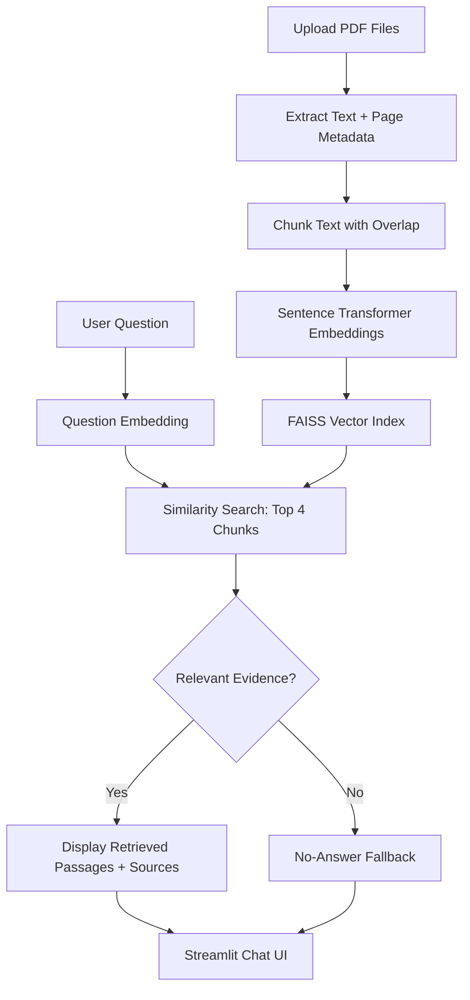

# RAG Chatbot Workflow

```mermaid
flowchart TD
 A[Upload PDF Files] --> B[Extract Text + Page Metadata]
 B --> C[Chunk Text with Overlap]
 C --> D[Sentence Transformer Embeddings]
 D --> E[FAISS Vector Index]
 F[User Question] --> G[Question Embedding]
 G --> H[Similarity Search: Top 4 Chunks]
 E --> H
 H --> I{Relevant Evidence?}
 I -->|Yes| J[Display Retrieved Passages + Sources]
 I -->|No| K[No-Answer Fallback]
 J --> L[Streamlit Chat UI]
 K --> L
```
